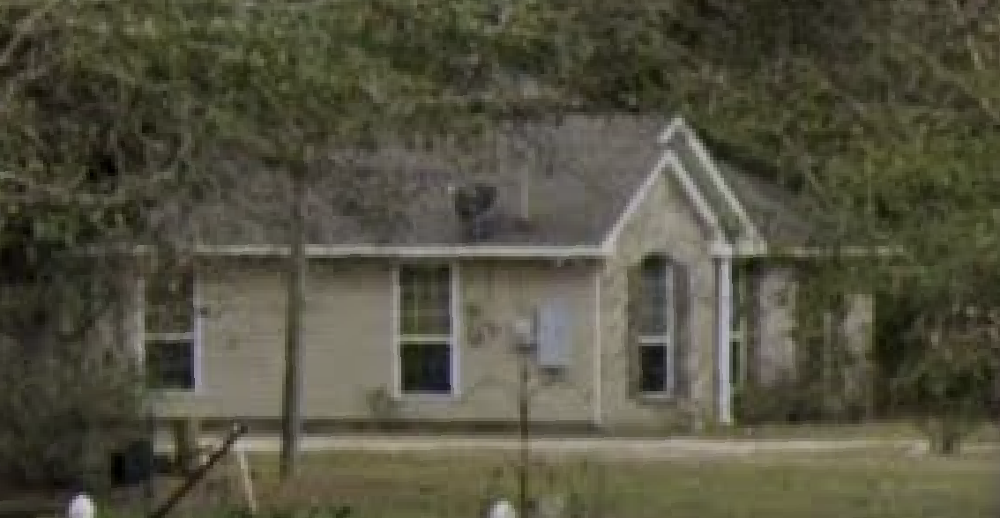

# Aunt Liz's House Renovation Project

## Project Overview

Complete renovation and staging of Aunt Liz's house to prepare for market listing.

## Project Goals

- Renovate and refresh the property to maximize market appeal
- Complete all work within budget
- List the house in optimal condition

## Project Status
**Status:** Planning Phase
**Start Date:** November 4, 2025
**Target Listing Date:** April 20, 2026

## Optimal Listing Time
Based on real estate market analysis, the best time to list a house is in the spring, typically May or June. This period sees the highest buyer activity, leading to potentially higher sale prices and faster sales. Our target listing date of April 20, 2026, is set to capitalize on the start of this peak season.

## Quick Links

- [Task List & Timeline](../../Wiki/64241-west-powerlilne-rd/TASKS.md)
- [Budget & Estimates](../../Wiki/64241-west-powerlilne-rd/BUDGET.md)
- [Materials & Colors](../../Wiki/64241-west-powerlilne-rd/MATERIALS.md)
- [Vendor Contacts](../../Wiki/64241-west-powerlilne-rd/VENDORS.md)

## Major Work Items

1.  **Demolition & Removal**
    
    - Remove carpet from all rooms
    - Remove curtains
    - Remove most furniture
2.  **Repairs & Replacements**
    
    - Replace back exterior door
    - Replace window sill
3.  **Interior Finishing**
    
    - Paint entire interior
    - Paint cabinets
    - Install new carpet in 3 rooms
4.  **Final Prep**
    
    - Deep clean entire house
    - Stage house for showing
5.  **Listing**
    
    - Professional photography
    - List house on market

## Project Structure

```
64241-west-powerlilne-rd/
├── README.md           # This file - project overview
├── QUICK-START.md      # Quick start guide
├── TASKS.md            # Detailed task list and timeline
├── TIMELINE.md         # Project timeline
├── VENDORS.md          # Contractor and vendor contacts
├── MATERIALS.md        # Material selections and specs
├── BUDGET.md           # Budget breakdown and estimates
└── GEMINI.md           # Additional project notes
```

## Next Steps

1.  Complete budget estimates for all work items
2.  Select paint colors and carpet materials
3.  Get contractor quotes
4.  Create detailed timeline
5.  Begin work prioritization